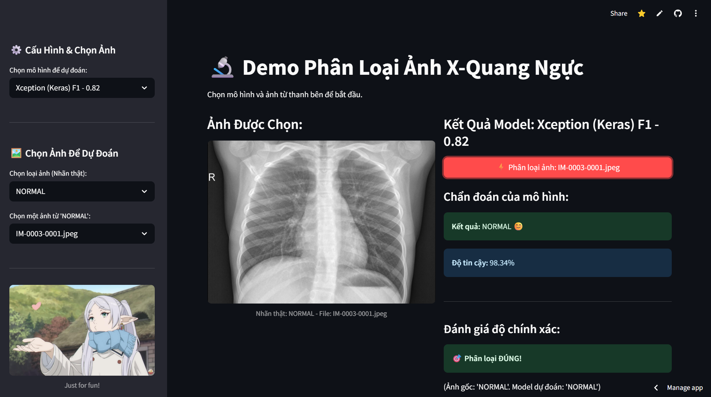

# Ứng dụng Phân tích ảnh X-quang Chẩn đoán viêm phổi

Dự án này xây dựng một ứng dụng web sử dụng Streamlit để phân loại ảnh X-quang ngực, giúp chẩn đoán bệnh viêm phổi (Pneumonia). Ứng dụng cho phép người dùng lựa chọn giữa nhiều mô hình học máy và học sâu khác nhau để nhận được dự đoán với độ chính xác và độ tin cậy đi kèm.

## Streamlit Web App
**[https://x-quang-detect-pneumonia.streamlit.app/](https://x-quang-detect-pneumonia.streamlit.app/)**




## Cấu trúc thư mục

```
x-quang-root/
├── model/
│   ├── HOG_Logistic_Regression_model.pkl
│   ├── HOG_Random_Forest_model.pkl
│   ├── HOG_SVM_model.pkl
│   ├── LBP_Logistic_Regression_model.pkl
│   ├── LBP_Random_Forest_model.pkl
│   ├── LBP_SVM_model.pkl
│   └── Xception_model.keras   
├── test_photo/
│   ├── NORMAL/                 # Ảnh X-quang bình thường để thử nghiệm
│   │   ├── IM-0001-0001.jpeg
│   │   └── ...
│   └── PNEUMONIA/              # Ảnh X-quang viêm phổi để thử nghiệm
│       ├── person1_bacteria_1.jpeg
│       └── ...
├── notebook.ipynb              # Notebook huấn luyện và phân tích
├── app.py                      # File mã nguồn chính của ứng dụng Streamlit
├── requirements.txt            
└── README.md                  
```

## Bộ dữ liệu (Dataset)

Dự án sử dụng bộ dữ liệu **"Chest X-Ray Images (Pneumonia)"** từ Kaggle.

  * **Nguồn:** [https://www.kaggle.com/datasets/paultimothymooney/chest-xray-pneumonia](https://www.kaggle.com/datasets/paultimothymooney/chest-xray-pneumonia)
  * **Mô tả:** Bộ dữ liệu chứa 5,863 hình ảnh X-quang ngực (định dạng JPEG) được chia thành hai loại: **Viêm phổi (Pneumonia)** và **Bình thường (Normal)**. Các hình ảnh này là ảnh chụp X-quang ngực của bệnh nhi từ một đến năm tuổi.
  * **Phân bổ:** Dữ liệu đã được chia sẵn thành các tập `train`, `test`, và `val`.

## Mô hình và Kỹ thuật

Dự án đã triển khai và so sánh hiệu suất của nhiều mô hình khác nhau:


#### 1. **Mô hình Machine Learning truyền thống:**

* Kỹ thuật trích xuất đặc trưng: LBP, HOG, Flattened (raw pixels)
* Mô hình phân loại: SVM, Logistic Regression, Random Forest

#### 2. **Mô hình Deep Learning và kết hợp:**

* Xception (fine-tuned trên tập dữ liệu chest X-ray pneumonia)
* Các mô hình trích đặc trưng từ CNN kết hợp với phân loại truyền thống:

  * ResNet + SVM / Logistic Regression
  * VGG + SVM / Logistic Regression
  * DenseNet + SVM / Logistic Regression


## Kết quả & Đánh giá

Hiệu suất của các mô hình được đánh giá trên tập kiểm tra (test set) và kết quả như bảng dưới, lưu ý trong ứng dụng demo streamlit chỉ sử dụng một mô hình tiêu biểu bởi giới hạn dung lượng repo của github.

| STT | Mô hình                 | Đặc trưng           | Accuracy | macro F1 | Recall lớp 0 | Recall lớp 1 |
| :-: | :---------------------- | ------------------- | :------: | :------: | :----------: | :----------: |
|  1  | **Xception**            | Deep Learning (CNN) | **0.85** | **0.82** |     0.65     |     0.97     |
|  2  | DenseNet + SVM          | CNN + SVM           |   0.81   |   0.77   |     0.51     |     0.99     |
|  3  | DenseNet + Logistic Reg | CNN + Logistic      |   0.79   |   0.74   |     0.46     |     1.00     |
|  4  | VGG + SVM               | CNN + SVM           |   0.79   |   0.74   |     0.46     |     0.99     |
|  5  | VGG + Logistic Reg      | CNN + Logistic      |   0.79   |   0.73   |     0.46     |     0.98     |
|  6  | ResNet + SVM            | CNN + SVM           |   0.79   |   0.74   |     0.47     |     0.99     |
|  7  | ResNet + Logistic Reg   | CNN + Logistic      |   0.77   |   0.70   |     0.40     |     0.99     |
|  8  | SVM                     | LBP                 |   0.79   |   0.74   |     0.50     |     0.96     |
|  9  | Logistic Regression     | LBP                 |   0.76   |   0.71   |     0.46     |     0.94     |
|  10 | SVM                     | Flattened (raw)     |   0.78   |   0.72   |     0.43     |     0.99     |
|  11 | Logistic Regression     | Flattened (raw)     |   0.75   |   0.67   |     0.35     |     0.99     |
|  12 | Random Forest           | Flattened (raw)     |   0.77   |   0.70   |     0.39     |     0.99     |
|  13 | Logistic Regression     | HOG                 |   0.74   |   0.65   |     0.31     |     0.99     |
|  14 | SVM                     | HOG                 |   0.72   |   0.62   |     0.27     |     0.99     |
